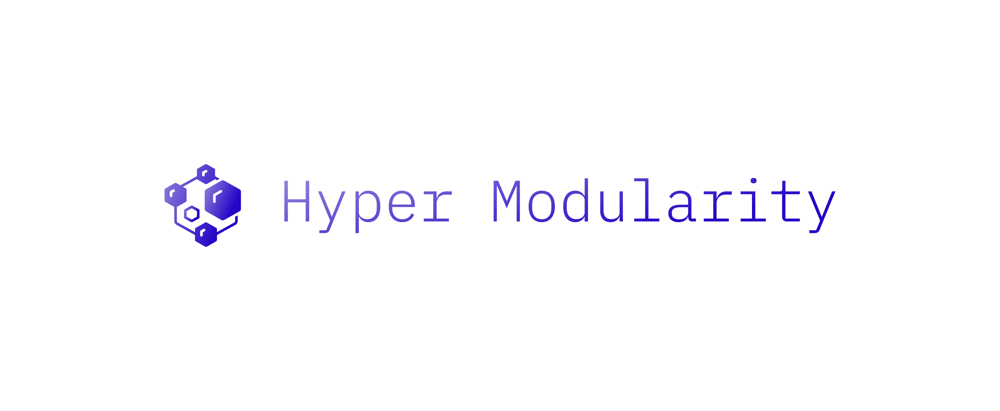
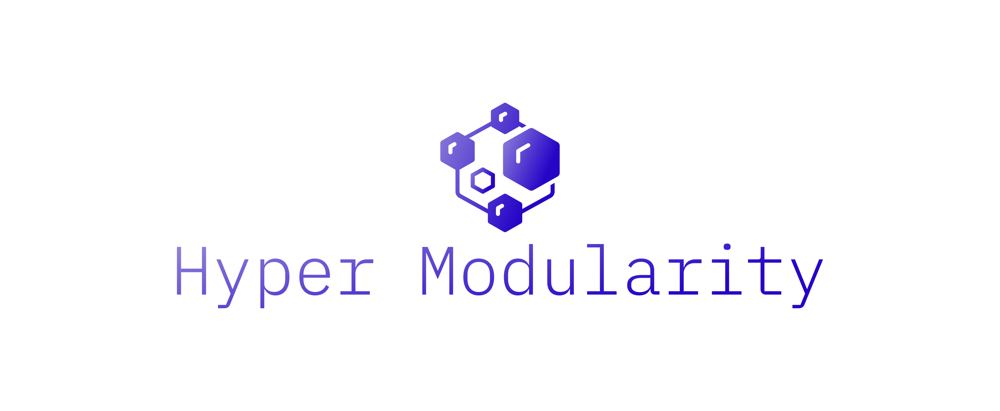

# logo
Logo HyperModularity

## Font

        font name: IBMPlexMono-Light
        font link: https://fonts.google.com/specimen/IBM+Plex+Mono
        font author: Mike Abbink
        font author site: https://www.mikeabbink.com/

        icon designer: priyanka
        icon designer link: /creativepriyanka

## css

        fontColor: {"gradient-0":"#9284DB","gradient-1":"#2705C7"}
        bgColor: {"hex":"transparent"}
        iconColor: {"gradient-0":"#9284DB","gradient-1":"#2705C7"}
  
  
# Colors   

## Font
  
    #9284DB, #2705C7

## Background
    
    transparent

## Icon

    #9284DB, #2705C7

# logo

## 1

## 2

          
